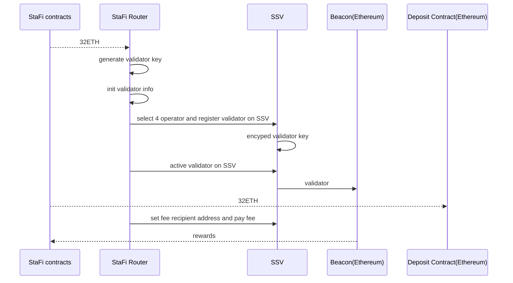

# Distributed Validator

DVT (Distributed Validator Technology), by allowing validators to run on multiple nodes or machines, has the potential to significantly enhance the decentralization and security of Ethereum. In light of this, StaFi has decided to integrate DVT into its ETH liquid staking service via a new module called StaFi Router, which will enable us to implement this technology and further enhance the security and decentralization of the Ethereum network.

## Benefits of the DVT

- **Safety (against key theft)**: The Validator's staking private key is secure unless security is compromised at more than M of the N Co-Validators.
- **Safety (against slashing)**:
  - Under the assumption of an asynchronous network, the Validator is never slashed unless more than 1/3rd of the Co-Validators are Byzantine.
  - Under the assumption of a synchronous network, the Validator is never slashed unless more than 2/3rds of the Co-Validators are Byzantine.
- **Liveness**: The protocol will eventually produce a new attestation/block under partially synchronous network unless more than 1/3rd of the Co-Validators are Byzantine.

$$M = ceil(2*N/3)$$

## Tradeoffs of the DVT

- **Increased Complexity**: As with any multi-node deployment, there are now more moving parts to running a validator as a whole. This requires limited coordination across the different operators in the cluster, and adds potential areas for things to go wrong.
- **Latency**: DVT introduces a few additional network hops by the consensus mechanism and message sharing across nodes in a cluster. This, however, is mitigated by designing DVT to use direct P2P connections across nodes in a cluster (rather than a singular gossip network).
- **Operational Costs**: As multiple nodes are required to participate instead of just a single node, there are increased operational and hardware costs. This can be offset by being able to run more validators on the same set of machines due to the improved resiliency of validators running DVT.

## How StaFi integrates DVT

### StaFi Router

The current StaFi ETH liquid staking validator function supports trust validators and solo validators. To support DVT and accommodate future expansion of validator types, we have developed a new module called Router. Router will integrate existing validator services with upcoming SSV support and use its allocation algorithm to assign user staked ETH to the corresponding validator.


General module

- Staking Pool Manager Contract：Handling user operations such as staking, unstaking, or withdrawing.
- IERC20 Token Contract: rETH token contract on Ethereum.
- Staking Pool Contracts: Implementation of the core functions of the staking pool.
- Ethereum Deposit Contract: Ethereum staking deposit contract
- StaFi Router: A router used for validator selection, activation and management.
- StaFi Relay: Off Chain: Data synchronization and scheduled trigger to update era.

### Router Algorithm

The Router will monitor the events and balance of the staking pool. The pool will set aside a specific amount of ETH for withdrawals. If the pool’s valid balance exceeds 20 ETH, users can choose to deposit 12 ETH as a solo validator and use their own server or SSV to activate the validator on the Beacon Chain. This activation process needs to be done manually. Once the pool’s valid balance exceeds 32 ETH, the Router will automatically generate a validator key, register a validator with SSV, and activate the validator on the Beacon Chain.

To increase decentralization, we plan to decrease the number of trust validators and use them only as a backup.


## SSV Integration

StaFi Router integrates with SSV using its API and SDK.



Struct: `Task`

```go
type Task struct {
	taskTicker                     int64
	stop                           chan struct{}
	eth1StartHeight                uint64
	eth1Endpoint                   string
	eth2Endpoint                   string
	superNodeKeyPair               *secp256k1.Keypair
	ssvKeyPair                     *secp256k1.Keypair
	gasLimit                       *big.Int
	maxGasPrice                    *big.Int
	storageContractAddress         common.Address
	ssvNetworkContractAddress      common.Address
	ssvNetworkViewsContractAddress common.Address
	seed                           []byte

	// --- need init on start
	dev                     bool
	chain                   constants.Chain
	superNodeConnection     *connection.Connection
	ssvConnection           *connection.Connection
	eth1WithdrawalAdress    common.Address
	superNodeContract       *super_node.SuperNode
	userDepositContract     *user_deposit.UserDeposit
	ssvNetworkContract      *ssv_network.SsvNetwork
	ssvNetworkViewsContract *ssv_network_views.SsvNetworkViews
	nextKeyIndex            int
	validators              map[int]*Validator

	eth2Config beacon.Eth2Config
}
```

A structure containing all relevant information about the SSV integration.

Struct: `Validator`

```go
type Validator struct {
	privateKey    *bls.PrivateKey
	keyIndex      int
	status        uint8
	registedOnSSV bool
	removedOnSSV  bool
}
```

A structure containing all relevant information about the SSV validator.

- function `checkAndRegisterOnSSV` : select operator and register validator to SSV contract
- function `checkAnddRepairNexKeyIndex`: generate validate key
- function `checkAndDeposit`: check the pool balance and init validator
- function `checkAndStake`: active validator

### Distribute Validator Key Generate

As the development of SSV’s DKG is currently in progress, the process of generating Validator Keys requires careful consideration of performance and security to ensure a high level of decentralization.

In the long term, once SSV’s DKG is completed, we will replace the current scheme with SSV’s DKG to further enhance security and decentralization.

### smart operator selection

SSV operators are evaluated based on various metrics such as price, status, and performance, as well as dynamic operations such as updated fees and off-boarding. To ensure optimal operator selection, the StaFi Router will periodically search for operator information on the SSV network at certain frequencies.

SSV related api:

- `/api/v4/{network}/operators`: SSV operator list
- `/api/v4/{network}/operators/operator`: SSV operator detail