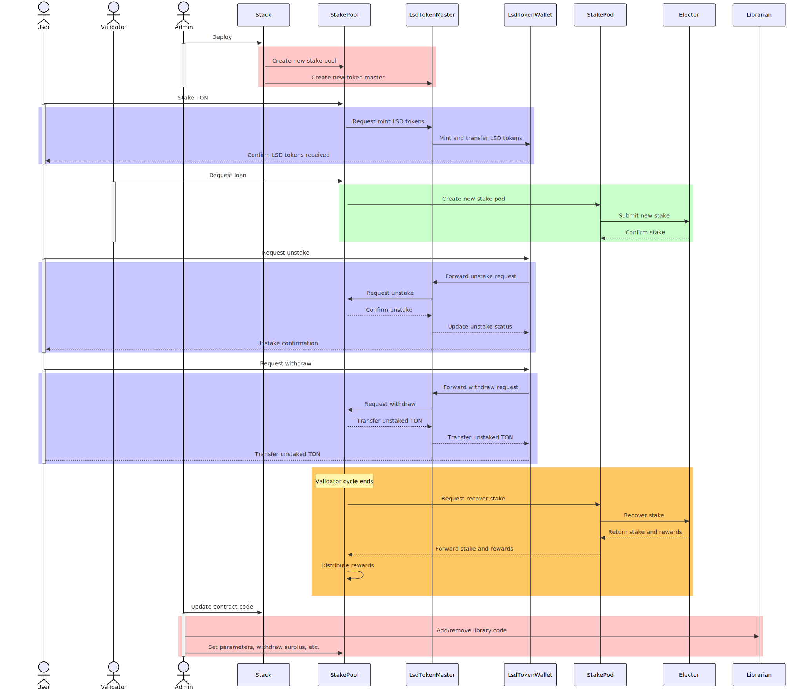

# TON LSD Stack Architecture

## Overview

The TON LSD (Liquid Staking Derivative) Stack is a set of smart contracts designed to enable liquid staking on the TON blockchain. This architecture allows users to stake their TON coins and receive liquid tokens in return, which can be used in various DeFi applications while still earning staking rewards.

## Smart Contracts

The core of the TON LSD Stack consists of several smart contracts:

### 1. Stack Contract

The Stack contract is the main entry point for the LSD system. It manages the creation of new stake pools and coordinates the overall functionality of the LSD ecosystem.

Key responsibilities:
- Create new stake pools
- Manage global parameters
- Handle fee distribution

### 2. Stake Pool Contract

The Stake Pool contract manages individual staking pools. Each pool represents a collection of staked TON coins from multiple users.

Key responsibilities:
- Handle user deposits (staking)
- Manage unstaking requests
- Interact with the TON blockchain's native staking mechanism
- Distribute rewards to LSD token holders

### 3. LSD Token Master Contract

This contract is responsible for minting and managing the LSD tokens that users receive in exchange for their staked TON coins.

Key responsibilities:
- Mint new LSD tokens when users stake
- Burn LSD tokens when users unstake
- Manage the total supply of LSD tokens

### 4. LSD Token Wallet Contract

This contract represents individual user wallets for LSD tokens.

Key responsibilities:
- Store user LSD token balances
- Handle token transfers
- Process unstaking requests

### 5. Stake Pod Contract

The Stake Pod contract interacts directly with the TON blockchain's native staking mechanism (the Elector contract).

Key responsibilities:
- Submit stake to the Elector
- Recover stake and rewards from the Elector

## Era

Similar to the other LSD Stack, the TON LSD Stack likely uses the concept of "Era" to manage time-based operations such as reward distribution and interest rate adjustments.

## Contract Flow

### Staking Flow

1. User sends TON coins to the Stake Pool contract.
2. Stake Pool contract receives the coins and interacts with the LSD Token Master contract.
3. LSD Token Master mints corresponding LSD tokens to the user's LSD Token Wallet.
4. In each era, the Stake Pod contract submits stakes to the Elector contract on the TON blockchain.

### Unstaking Flow

1. User initiates an unstake request through their LSD Token Wallet.
2. LSD Token Master burns the corresponding amount of LSD tokens.
3. Stake Pool contract queues the unstaking request.
4. After the unbonding period, users can withdraw their original TON coins.

## Relay Service

The Relay Service is a crucial off-chain component of the TON LSD Stack. It interacts with the on-chain smart contracts to facilitate various operations in the liquid staking system. This service is responsible for monitoring and triggering key processes in the stake pools.

### Key Features

1. Continuous Monitoring: The relay service runs continuously, checking the state of stake pools at regular intervals (every 30 seconds).
2. Round Management: It manages different stages of staking rounds, including allocation, updating, and finishing.
3. Smart Contract Interaction: The service sends external messages to the stake pool smart contract to trigger various operations.