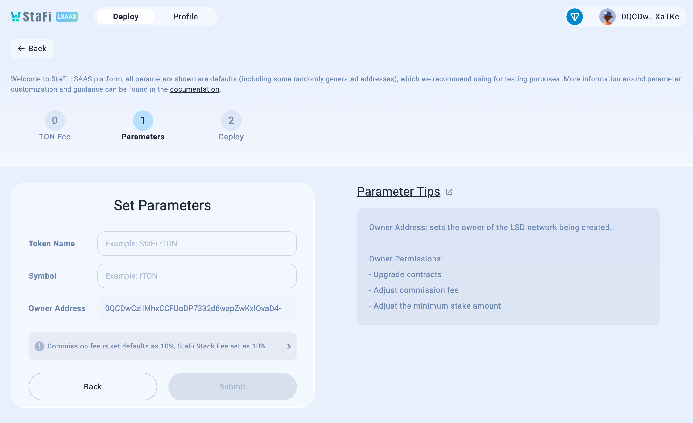
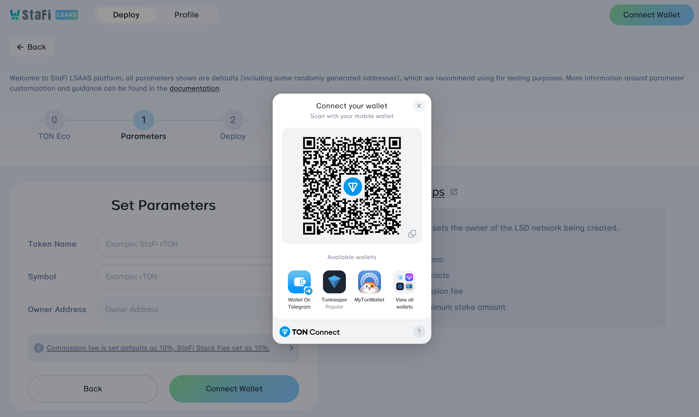
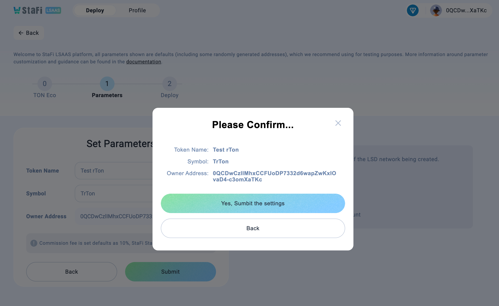

This guide provides a step-by-step script to deploy the Ton LSD stack, without knowing details about contracts and services. Read the documentation for comprehensive understandings of these components.


## Step1. Deploy your LSD network contracts

61 Lab have made [StaFi LSAAS](https://stack-app.stafi.io/) for project parties to deploy their LSD network contracts.

Link to your wallet, such as Tonkeeper, for follow-up actions





### Parameter Tips

Token Name: sets the name of the LSD token.

Token Symbol: sets the symbol of the LSD token.

Owner Address: sets the owner of the LSD network being created.

### Rewards Distribution

Rewards distribution is crucial to project parties. Commission fee of users is set default as 10% and StaFi Stack fee is 10% of the project income. for example, if `100Ton` rewards received from the chain, the distribution will be:

| Role | Amount | Formula |
|---------------|--------|-------|
|  Users        |  90 | 100*(1-0.1)  |
|  Project      |  9  | (100-90)*(1-0.1)  |
|  StaFi Stack  |  1  | 100-90-9  |

### Save all the information generated

The lsd network has a set of accounts, so you should save all the information which you will interact frequently with, such as Solana LSD App and Relay service.

- Owner address
- LSD Token Address
- Stake Pool Address

## Step2. Run relay service

#### Install Build Tools

Install `make`, `gcc` and `git`

```bash
sudo apt update
sudo apt install -y make gcc git build-essential
```

Install `go` by following the [official docs](https://golang.org/doc/install). Remember to set your `$PATH` environment variable, for example:

```bash
cd $HOME
wget -O go1.22.8.linux-amd64.tar.gz https://go.dev/dl/go1.22.8.linux-amd64.tar.gz
rm -rf /usr/local/go && tar -C /usr/local -xzf go1.22.8.linux-amd64.tar.gz && rm go1.22.8.linux-amd64.tar.gz
echo 'export GOROOT=/usr/local/go' >> $HOME/.bashrc
echo 'export GOPATH=$HOME/go' >> $HOME/.bashrc
echo 'export GO111MODULE=on' >> $HOME/.bashrc
echo 'export PATH=$PATH:/usr/local/go/bin:$HOME/go/bin' >> $HOME/.bashrc && . $HOME/.bashrc
go version
```

#### Install relay service

```bash
$ git clone https://github.com/stafiprotocol/ton-lsd-relay.git
$ cd ton-lsd-relay
$ make install
```

#### Start relay services

Take testnet as an example

```bash
$ ton-lsd-relay start --global_config_url=https://ton.org/testnet-global.config.json --stake_pool={StakePool Address}
StakePool: {StakePool Address}
Global config url: https://ton.org/testnet-global.config.json
Log level : info

Check config info, then press (y/n) to continue:
y
INFO[2024-10-15T13:24:15+08:00] start success
```

