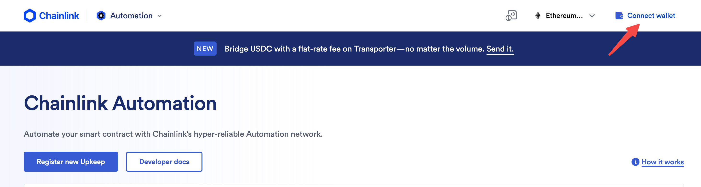
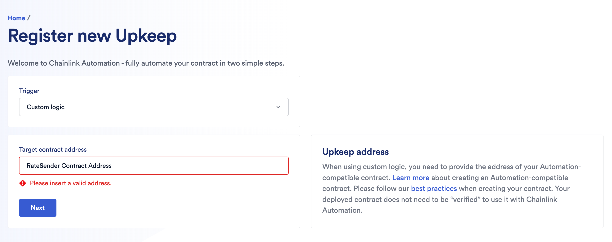
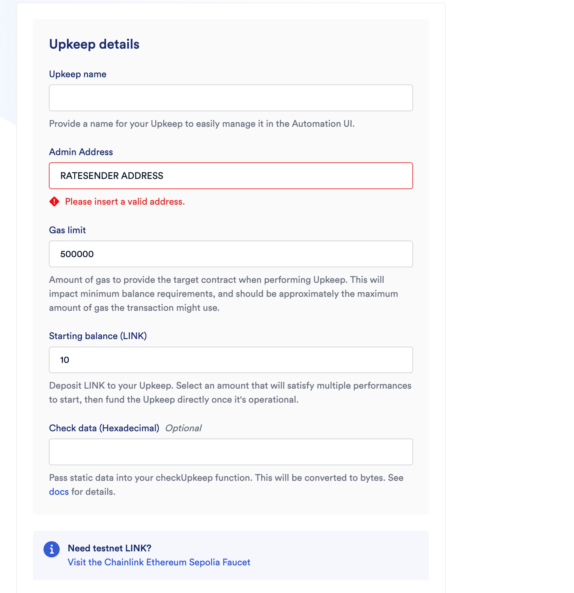
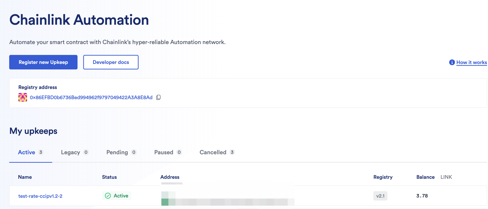

## Overview

The CCIP Modules are designed to facilitate cross-chain asset transfers of LST tokens between EVM chains and synchronize exchange rates.

## Compatibility

- Supports all EVM chains [supported by ChainLink](https://docs.chain.link/ccip/supported-networks)
- Enables automated cross-chain exchange rate synchronization
- Supports token cross-chain transfers (requires collaboration with Chainlink for TokenPool deployment before CCIP 1.5 update)

## Introduction

The CCIP Modules comprise two main components:

1. Exchange Rate Cross-Chain Module
2. Token Cross-Chain Module

These modules are independent and can be deployed and used separately.

Repository: [Evm Module Contracts](https://github.com/stafiprotocol/evm-module-contracts)

### Rate Cross-Chain

Includes four main contracts:
- `RateSender`: Deployed on the source chain, periodically checks for rate updates and sends rate messages. Supports Proxy deployment for upgradability.
- `RateReceiver`: Deployed on the destination chain, receives LST rates.
- `CCIPRateProvider`: Deployed on the destination chain, provides LST rates for third-party use.
- `RegisterUpkeep`: Integrates Automation service, enables automatic triggering upon deployment.

### Token Cross-Chain

Includes one main contract:
- `TokenTransferor`: Deployed using Proxy pattern, supports upgrades and permission control.

Note: Token cross-chain functionality requires whitelisting with Chainlink

## Installation

### Prerequisites
- Node.js
- Yarn

### Steps

1. Clone the repository:
   ```bash
   git clone https://github.com/stafiprotocol/evm-module-contracts.git
   cd evm-module-contracts
   ```

2. Install dependencies:
   ```bash
   yarn install
   ```

3. Configure the network in `hardhat.config.js`,Add or replace the original chain and target chain configuration for your intended deployment:
   ```javascript
   networks: {
       hardhat: {
           allowUnlimitedContractSize: true,
       },
       local: {
           allowUnlimitedContractSize: true,
           url: "http://127.0.0.1:8545/"
       },
       fuji: {
           url: process.env.AVALANCHE_FUJI_RPC,
           accounts: [process.env.PRIVATEKEY]
       },
       ethSepolia: {
           url: process.env.SEPOLIA_RPC,
           accounts: [process.env.PRIVATEKEY]
       },
   }
   ```

4. Set up environment variables in `.env` file,Add or replace the original chain and target chain configuration for your intended deployment:
   ```bash
   AVALANCHE_FUJI_RPC=https://ava-testnet.public.blastapi.io/ext/bc/C/rpc
   SEPOLIA_RPC=https://rpc.ankr.com/eth_sepolia
   PRIVATEKEY=
   EHTERSCAN_API_KEY=
   ```

## Deployment

### Rate Cross-Chain Deployment

**The Router and Link addresses for each chain, as well as the chain selector, are available from [networks supported by Chainlink](https://docs.chain.Link/ccip/supported-networks)**

#### Option 1: Deploy contracts individually

1. Deploy `RateSender` on the source chain:
   ```bash
   ROUTER_ADDRESS=0x.. LINK_ADDRESS=0x.. npx hardhat run ./scripts/RateMsg/deploy_sender.js --network source_chain
   ```

2. Deploy `RateReceiver` on the destination chain:
   ```bash
   ROUTER_ADDRESS=0x.. ALLOWED_SENDER_ADDRESS=0x.. npx hardhat run ./scripts/RateMsg/deploy_receiver.js --network dest_chain
   ```

3. Deploy `CCIPRateProvider` on the destination chain:
   ```bash
   INITIAL_RATE=1000000000000000000 RECEIVER_ADDRESS=0x.. npx hardhat run ./scripts/RateMsg/deploy_rate_provider.js --network dest_chain
   ```

#### Option 2: Deploy all contracts at once

1. Copy and modify the configuration file:
   ```bash
   cp ./scripts/RateMsg/config.example.json ./scripts/RateMsg/config.json
   ```

2. Modify `config.json`:
   ```json
   {
     "routerAddressSource": "0x..", // Source chain router address
     "routerAddressDestination": "0x..", // Destination chain router address
     "linkAddressSource": "0x..", // Source chain LINK address
     "linkAddressDestination": "0x..", // Destination chain LINK address
     "initialRate": "1000000000000000000", // Initial rate for the destination chain
     "tokens": [] // Use when testing, leave blank when deploying to a production environment
   }
   ```

3. Run the deployment script:
   ```bash
   NETWORK_SOURCE=source_chain NETWORK_DESTINATION=dst_chain ./scripts/RateMsg/deploy_all.sh
   ```

#### RegisterUpkeep Deployment

REGISTRAR_ADDRESS from [Automation Documents](https://docs.chain.link/chainlink-automation/overview/supported-networks)
```bash
LINK_ADDRESS=0x.. REGISTRAR_ADDRESS=0x..  npx hardhat run ./scripts/RateMsg/deploy_register_upkeep.js --network source_chain
```

### Token Cross-Chain Deployment


Deploy the `TokenTransferor` contract:
```bash
ROUTER_ADDRESS=0x.. npx hardhat run ./scripts/TokenTransfer/deploy.js --network source_chain
```

## Configuration

1. Configure `RateSender` contract:
   - Add token information using `addTokenInfo` method:
     ```solidity
     /// @notice Adds a new token rate and its associated information for a specific chain
     /// @dev This function combines the functionality of adding a token rate and its chain-specific information
     /// @param tokenName The name of the token to add
     /// @param _rateSource The address of the contract providing the rate for this token
     /// @param _receiver The address of the receiver contract on the destination chain
     /// @param _dstRateProvider The address of the rate provider contract on the destination chain
     /// @param _selector The chain selector for the destination chain
     function addTokenInfo(
         string memory tokenName,
         address _rateSource,
         address _receiver,
         address _dstRateProvider,
         uint64 _selector
     ) external onlyRole(ADMIN_ROLE)
     ```
   - Add new destination chains using `addTokenDstInfo` method:
     ```solidity
      /// @notice Adds destination information for a token
     /// @param tokenName Name of the token
     /// @param _receiver Receiver address on the destination chain
     /// @param _dstRateProvider Rate provider address on the destination chain
     /// @param _selector Chain selector for the destination chain
     function addTokenDstInfo(
         string memory tokenName,
         address _receiver,
         address _dstRateProvider,
         uint64 _selector
     ) external onlyRole(ADMIN_ROLE)
     ```

2. Fund `RateSender` contract with LINK tokens for cross-chain message fees

3. Register Upkeep contract with Chainlink Automation:
   - Option 1: Use [Chainlink Automation web interface](https://automation.chain.link)
    
     
     
   - Option 2: Deploy `RegisterUpkeep` contract and call `registerAndPredictID` method:
     - Authorize a certain amount of LINK tokens to the `RegisterUpkeep` contract for paying fees to Chainlink when registering Upkeep.
     ```solidity
     function registerAndPredictID(
         Params calldata params
     ) external payable nonReentrant whenNotPaused returns (uint256)

     struct Params {
         string name; // upkeep name
         string email; // optional Chainlink Automation is not currently enabled
         address upkeepContract; // address of the RateSender contract
         uint32 gasLimit; // gas limit for the upkeep
         address adminAddress; // address of the admin
         uint96 amount; // amount of LINK tokens
     }
     ```
     After a successful call to registerAndPredictID, you can see something like this on the web interface

     

## Usage

### Token Cross-Chain Transfer

1. Authorize tokens for cross-chain transfer to the `TokenTransferor` contract
2. Call `updateChainAllowlist` and `updateTokenAllowlist` methods on the `TokenTransferor` contract:
   ```solidity
   function updateChainAllowlist(uint64 _destinationChainSelector, bool _allowed) external onlyRole(ADMIN_ROLE)
   function updateTokenAllowlist(address _token, bool _allowed) external onlyRole(ADMIN_ROLE)
   ```
3. Call `transferTokens` method on the `TokenTransferor` contract:
   ```solidity
   /// @notice Calculate the required fee for transferring tokens to another chain.
   /// @dev This function simulates the token transfer process to calculate the fee,
   ///      without actually performing the transfer. It uses the same logic as the
   ///      transferTokens function to ensure fee consistency.
   /// @param _destinationChainSelector The identifier (selector) for the destination blockchain.
   /// @param _receiver The address of the recipient on the destination blockchain.
   /// @param _token The address of the token to be transferred.
   /// @param _amount The amount of tokens to be transferred.
   /// @return fees The amount of native currency required as fee for the cross-chain transfer.
   function transferTokens(
       uint64 _destinationChainSelector,
       address _receiver,
       address _token,
       uint256 _amount
   )
   external
   payable
   nonReentrant
   validateReceiver(_receiver)
   onlyAllowlistedToken(_token)
   onlyAllowlistedChain(_destinationChainSelector)
   returns (bytes32 messageId)
   ```

## Notes

- All CCIP cross-chain transactions can be viewed on [CCIP Explorer](https://ccip.chain.link) using the source chain transaction hash.
- Token cross-chain functionality requires whitelisting with Chainlink.
- Router addresses and chain selectors can be found in the [ChainLink supported networks documentation](https://docs.chain.link/ccip/supported-networks).
