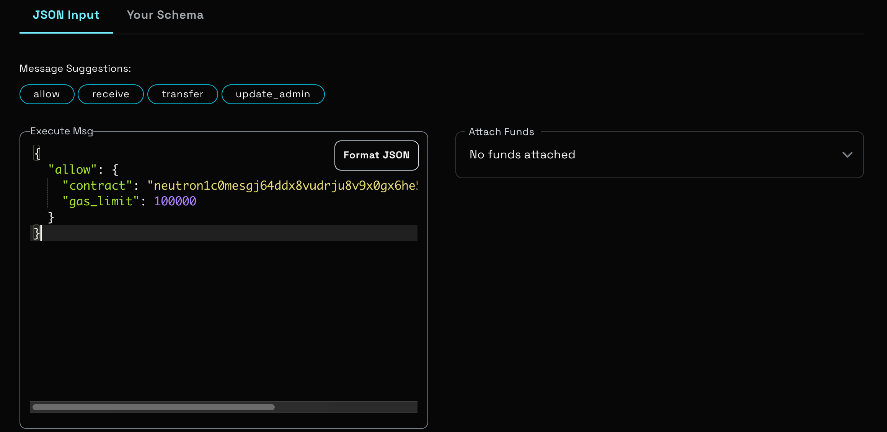
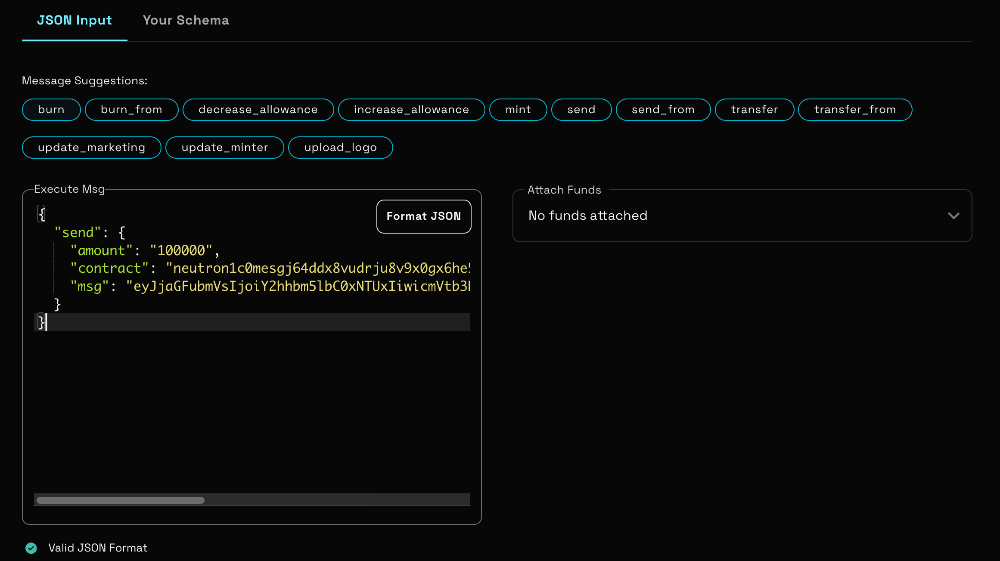

# Neutron Token ICS20 Module

This guide explains how to set up and use the CW20-ICS20 contract on Neutron for cross-chain token transfers.

## Overview

The CW20-ICS20 module enables cross-chain transfers of CW20 tokens (like LSD tokens) between Neutron and other IBC-enabled chains. The process involves deploying a contract, setting up IBC channels, and configuring token allowlists.

## Setup Process

### 1. Deploy CW20-ICS20 Contract

First, deploy the CW20-ICS20 contract on Neutron. This contract can be reused for multiple LSD tokens.

You can find the CW20-ICS20 contract in [Cosmos wasm contracts](https://github.com/CosmWasm/cw-plus/tree/main/contracts/cw20-ics20), compile and deploy it

```bash
# Deploy the CW20-ICS20 contract on Neutron
# Note: Store your contract deployment commands and contract address

CW20_ICS0_CONTRACT_PATH="{your-path}/cw20-ics20.wasm"

echo "----------------------------- store cw20-ics20 contract -------------------------------"

ics_code_id="$(neutrond tx wasm store "$CW20_ICS0_CONTRACT_PATH" \
    --from "$<your-address>" --gas 50000000 --chain-id neutron-1 \
    --broadcast-mode=sync --gas-prices 0.0025untrn -y \
    --output json --home "$<your-home-path>" \
    --node "$NEUTRON_NODE" |
    wait_tx | jq -r '.events[] | select(.type == "store_code").attributes[] | select(.key == "code_id").value')"
echo "ics_code_id: $ics_code_id"

init_ics20_msg='{"default_timeout":1000,"gov_contract":"'$<your-address>'","allowlist":[{"contract":"'$<your-lsd-token-address>'","gas_limit": 100000}]}'

echo "----------------------------- init cw20-ics20 contract -------------------------------"

ics20_contract_address=$(neutrond tx wasm instantiate "$ics_code_id" "$init_ics20_msg" \
    --from "$<your-address>" --admin "$ADMIN" -y --chain-id neutron-1 \
    --output json --broadcast-mode=sync --label "init-ics20" \
    --keyring-backend=test --gas-prices 0.0025untrn --gas auto \
    --gas-adjustment 1.4 --home "$<your-home-path>" \
    --node "$NEUTRON_NODE" 2>/dev/null |
    wait_tx | jq -r '.events[] | select(.type == "instantiate").attributes[] | select(.key == "_contract_address").value')
echo "CW20 ICS20 Contract address: $ics20_contract_address"
```

#### Parameter Description
1. default_gas_limit: If set, contracts off the allowlist will run with this gas limit. If unset, will refuse to accept any contract off the allow list.
2. default_timeout: Default timeout for ics20 packets, specified in seconds
3. gov_contract: who can allow more contracts
4. allowlist.gas_limit: setting a usable Gas limit for the execution of target chain SubMsg.

### 2. Create IBC Channel

After deploying the contract, create an IBC channel between Neutron and the target chain. Use the Hermes binary with the following command:

```bash
# Replace variables with your specific values
CW20_ICS20_PORT="wasm.<your-cw20-ics20-contract-address>"

hermes --config $<your-config-dir> create channel \
    --order unordered \
    --a-chain neutron-1 \
    --a-connection connection-{your-connection-id} \
    --a-port "$CW20_ICS20_PORT" \
    --b-port transfer \
    --channel-version ics20-1
```

Make note of the channel ID that is created, as it will be needed for token transfers.

Note: After creation, make sure that the corresponding channel has been added to the whitelist in your Hermes config file

For example:
```toml
[chain.packet_filter]
policy = 'allow'
list = [
 ['wasm.neutron...',"*"]
]
```

### 3. Configure Token Allowlist

Add your CW20 token (LSD token) to the allowlist using the CW20-ICS20 contract's Allow method:

We added the corresponding lsd_token_address to the allowlist during deployment. If we want to add more lsd_token_addresses later, we can perform the Allow operation again

```bash
# Execute the Allow method on the CW20-ICS20 contract
# Replace with your specific contract addresses and token details

neutrond tx wasm execute "$ics20_contract_address" \
    '{"allow":{"contract":"'$<your-lsd-token-address>'","gas_limit": 10000000}}' \
    --from "$<your-address>" --gas 50000000 --chain-id neutron-1 \
    --broadcast-mode=sync --gas-prices 0.0025untrn -y \
    --output json --home "$<your-home-path>" \
```

- You can also use the [blockchain explorer](https://neutron.celat.one/) to initialize and add to the allow list:


### 4. Initiate Token Transfer

To transfer tokens, execute a `send` operation on your LSD token contract with a specific message. Here's how to prepare the transfer message:

```bash
# Prepare the channel message
channel_msg=$(printf '{
    "channel":"%s",
    "remote_address":"%s"
}' "$<your-channel-id>" "$<destination-address>")

# Base64 encode the message
channel_msg_base64="$(echo -n "$channel_msg" | base64 | tr -d '\n' | jq -sRr '@uri')"

# Include the encoded message in the transaction
lsd_token_send_msg=$(printf '{
    "send":
    {
      "contract":"%s",
      "amount":"100000",
      "msg":"%s"
    }
}' "$ics20_contract_address" "$channel_msg_base64")

# Execute the send operation on your LSD token contract
```



### 5. Token Flow

#### Neutron → Target Chain

1. LSD tokens are locked in the CW20-ICS20 contract on Neutron
2. Recipient receives IBC-wrapped tokens (like ibc/E4061FDF70B906A3DE1A8F3B1334329C86DA7C90C96AF1AFCAE81BB72D0E8C89) on the target chain

#### Target Chain → Neutron

1. Use standard IBC transfer to send IBC tokens back to Neutron
2. The CW20-ICS20 contract will:
   - Intercept the IBC packet
   - Release the locked LSD tokens
   - Send them to the specified recipient address

```bash
target_chain_binary tx ibc-transfer transfer transfer $<your-channel-id> \
    "$<neutron-address-recipient>" 1000$<token-denom> \
    --gas auto --gas-adjustment 1.4 \
    --fees 100000ufee --from $WALLET \
    --chain-id="$<target-chain-id>" --node "$<rpc-endpoint>" \
    -y --output json
```

## Important Notes

- Always verify contract addresses and channel IDs before executing transfers
- Ensure sufficient gas fees for all transactions
- Test with small amounts first
- Keep track of the channel ID used for transfers
